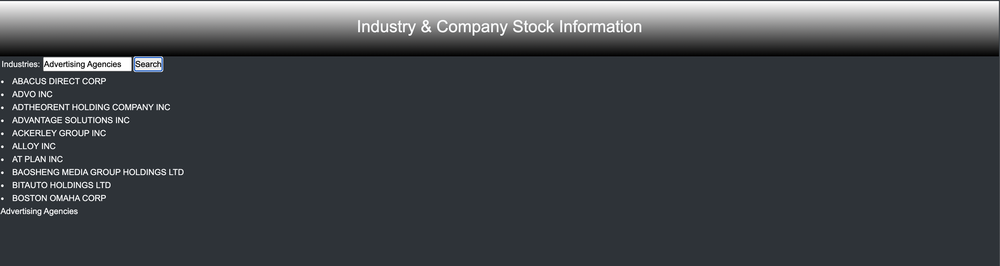
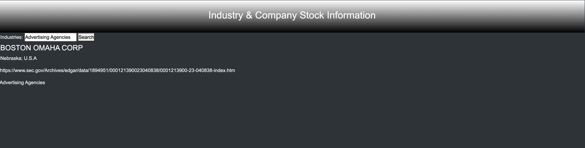

# Business Insider
An SEC database search App
## Table of Contents

* [Description](#description)
* [Links](#links)
* [Purpose](#purpose)
* [Screenshots](#screenshots)
* [Technologies Used](#technologies)
* [Licence](#license)
* [Credits](#credits)
## Description

A finacial and company information App using SEC APIs

## Links
<a href="https://crisesaverting.github.io/anotherWeatherApp/">Weather App</a>

## Purpose

An app to provide basic company information based on industry

## Screenshots

## Technologies

## License

## Credits
Some of these materials were developed by the 2U/edX Coding Curriculum Team for use with bootcamp students.